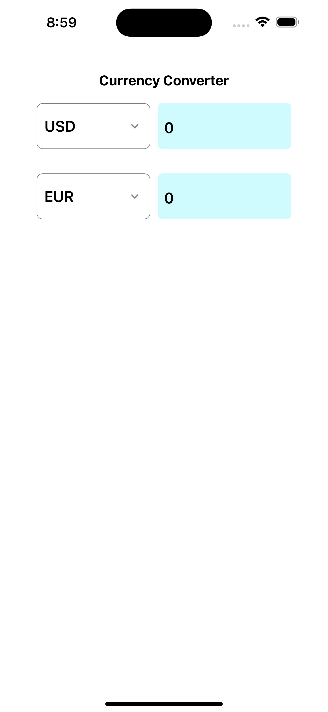
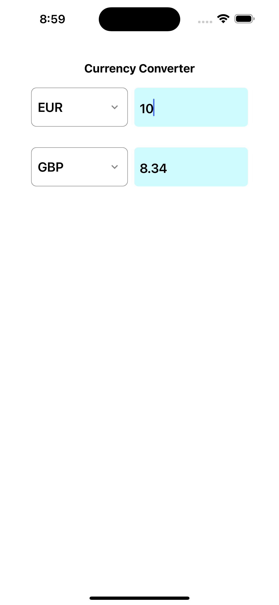

# Currency Converter App 💱

This **Currency Converter App** is built using **React Native**. It allows users to select source and destination currencies from dropdowns, fetches the latest exchange rates using the **ExchangeRate API**, and converts the input amount to the selected destination currency.

---

## Features ✨
- Select source and destination currencies from dropdowns.
- Fetch real-time exchange rates from the **ExchangeRate API**.
- Convert the amount entered in the source field and display it in the destination field instantly.
- Responsive UI for both Android and iOS devices.

---

## Screenshots 📸

### 1. Currency Selection


### 2. Conversion


---

## How to Run 🏃‍♂️

1. Clone the repository:
    ```bash
    git clone https://github.com/anirudhsingh8/CurrencyConverter.git
    ```

2. Navigate to the project directory:
    ```bash
    cd CurrencyConverter
    ```

3. Install dependencies:
    ```bash
    npm install
    ```

4. Run the app on an Android or iOS simulator:
    ```bash
    npm start
    ```

---

## Concepts Used 💡
- **API Calls**: Used `fetch` to get exchange rates from the **ExchangeRate API**.
- **Dropdown Menus**: Implemented dropdowns to let users select source and destination currencies.
- **Real-Time Conversion**: Updated the destination currency value as the user typed in the source amount.
- **State Management**: Used `useState` and `useEffect` to manage currency selection and input fields.